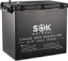

# Solar

In the next couple of years, I plan on learning about how solar systems work and
how to safely build one.

I aim to apply that knowledge by building a number of solar systems on my
property.
I don't expect to gain enough knowledge and confidence to convert my house to
island solar by myself.
This would most likely not make financial sense as the number of solar vendors
already seems decent and will likely continue to rise.
Not to mention the time investment.

However I do have a couple of subsystems I would like to see exist which should
be enjoyable challenges suitable for building them by myself.

The simplest one is a garden shed system with a couple of solar panels powering
a few appliances including a fridge, a light, a water heater, a space heater or
a heat pump, a water filter and a couple of internal outlets (for charging
devices and powering the camera and the modem) and external outlets (to use with
the grass trimmer and possibly outdoor lights).

Another simple system would be the basement of the house.
The idea is to disconnect it from the house and power it as a standalone unit.
This system would have to be big enough to reliably power a fridge, a freezer,
a ventilation system possibly combined with a dehumidifier, a well pump, lights
and a system of outlets to plug monitoring electronics into such as temperature
sensors, humidity sensors, a dedicated access point and possibly a Nuc running
the monitoring system. Also a set of cameras.
What makes this system more complicated than the shed system is that it would
have to use panels mounted at the roof of the house or installed outside on the
land.
This is not a problem per se, I am not yet plan on using the roof for solar
panels to power the house so it is available, but I would not want to do the
installation myself.
I might take a stab at installing the panels on the land and seeing how well
that works.

The most complex system I have in mind is the barn. I do not use a lot of
battery powered power tools and I have a few tools which curently run off the
three phase 400 V power, so to install enough battery capacity to be able to
power all these inductive loads and choose the right configuration and chemistry
for the job is bound to be a task that will see some iteration before I can call
it done, if ever.
It is however possible that I will end up using more battery powered hand power
tools and replace my 400 V equipment with newer variants that can run off 230 V
single phase so I won't end up needing as much capacity and a normal type of
system will suffice.
I am not sure what's the state of the art on this type of technology and how
feasible replacing these large tools like my saws, planers etc. really is.

That all being said, I expect this to be a long term learning-first endeavour
and I don't have a more refined goal in mind than just to iterate on these
systems and try to learn as much as I can.
The real benchmark here is not the end result so much so as the time spend and
enjoyed.

There is a bunch of solid solar resources online and I've already absorbed a
few basic lessons, but I still have a lot to learn.
The resource I find the most promising at the moment is the collective work of
Will Prowse distributed across his:

- [*DIY Solar Power* channel](https://www.youtube.com/c/WillProwse)
- [mobile-solarpower.com site](https://www.mobile-solarpower.com)
- [*DIY Solar Power* forum](https://diysolarforum.com)

I might come up with a study plan and I will definitely intertwine projects of
increasing scale into the learing process, all of which will be covered in this
repository.

## SOK 12 V 206 Ah LiFePO4 battery

In my system with a single panel and a single battery that I already have
running as an initial experiment, I am using a cheap SLA battery with a very low
capacity.
I have bought this battery as a replacement and future-proofing for this system
as it uses the LiFePO4 chemistry and has low temperature charging protection as
well as a marine-grade case resistant to humidity which is currently important
to me as the system is running in my barn where both the temperature and the
humidity are a problem in winter months.

https://www.europe.sokbattery.com/product-page/marine-grade-12v-206ah-lifepo4-battery-sealed-plastic-box-bluetooth-built-in-he

I'll need to buy a proper solar charge controller and inverter to use with it
next.

- [ ] Wait for the battery to come and install it into the system
