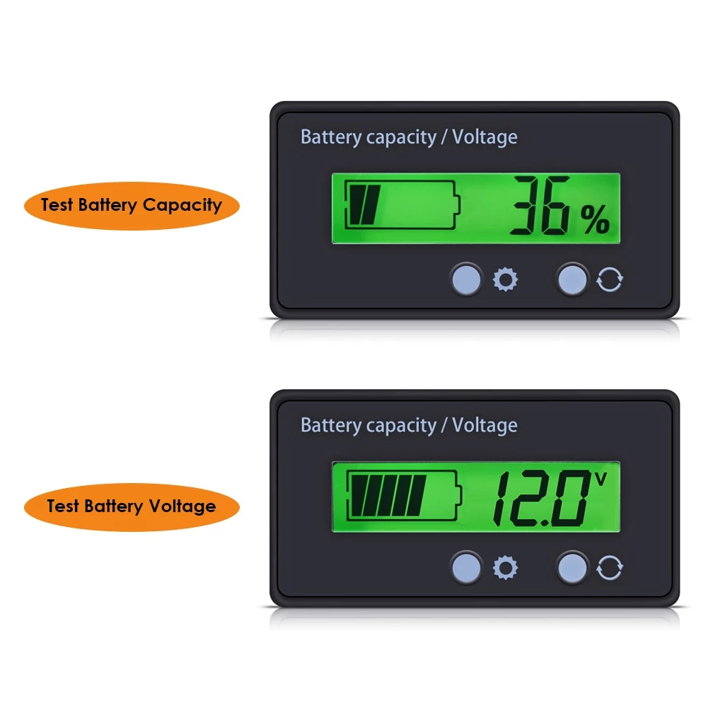
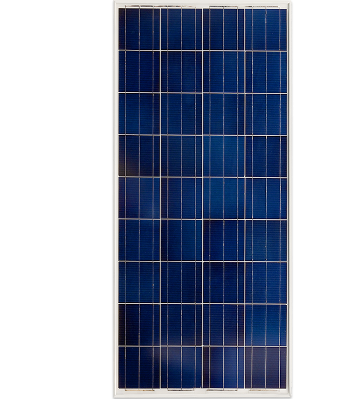

# Solar

Throughout the next few years, I aim to experiment with and learn about solar
systems with the ultimate goal of building a couple of systems on my property.

This repository is used to track the progress of both my learning and building.

## House

I don't intend to install solar on my house myself.
The risk of messing up in this application is too great and there are added
complexities in terms of the decision between an island system or a grid-tie
system.
Currently, I don't like the idea of a grid-tie system.
I do want to get the house fitted with solar, but I will most likely have a
contractor drive both the system design and the installation.
I will keep an eye on sourcing the panels, the batteries and the inverted though
as the local market prices seem overblown.

## Shed

I had a shed in mind I plan on building on the garden.
This is a perfect application for a DIY solar system IMO.
The shed roof will be about 7x4 m so it should fit quite a few solar panels.
I am not sure the total capacity I will be able to get out of that system, but
I want to power the following appliances with it:

- lights (internal and external)
- outlets (chargers and tools)
- fridge
- water heater / boiler
- space heater / heat pump
- water filter
- cameras
- network

Time will tell whether it will be financially feasible to install enough panels
and batteries to make this system a reality.

## Basement

The house basement is electrified and the electricity is used to run lights,
a ventilation/dehumidification loop, a well pump, a washer, a fridge, a freezer
and some sensors (temperature, humidity) and cameras.

I might be able to disconnect the basement from the house wiring and instead
power it off solar without having to put up panels on the roof.
I could use a land mounted system for it I believe.

I plan on adding a heat pump to the house so the main test will be whether it
could be powered off the basement system as well or if it would have to be
connected to the house wiring.

I might end up keeping the house and the basement integrated and running off
rooftop solar both.

## Barn

This system would be the most complicated.
I can do rooftop solar on the barn and there I might even take a stab at doing
it myself, but the question here is of course again the total available power.

I do have a bunch of power tools and machines in the barn which would require a
really big and solid battery setup to run completely in island mode.
Some of the machines use three phase 380 V power which seems like it would be
hard to replace with a batter setup.
I am sure a three phase inverter costs a fortune.

I might migrate to battery-based power tools and maybe replaced some of the shop
machines with more modern ones which might make do with a single phase, but it
will still be a lot of power that I'll have to make available for this project
to be a success.
Do they even make 230 V single phase planers and saws?
And are they any good?

This system seems like a good candidate for an interim phase which would not be
a grid-tie system, but a switch system between 100 % grid and 100 % batteries.
I could take my time with the attempts to gather enough storage to make the shed
run solely off batteries and before I get there, switch to the grid whenever the
current state of the storage doesn't cut it.

## Window

I have a unused utility window in my apartment which is very narrow and not too
useful as a regular window, but it is positioned such that it gets a decent
amount of light.

I have decided to also run a miniature system for fun using solar panels that
are chosen for fit instead of for performance and a PWM solar charge controller
as the panels produce so little current, even when they are all in paralle, any
dirt cheap solar charge controller can handle it and PWM is supposed to be a
bit better for purely paralle installations.

The panels I bought to board up the window with are these:

https://www.aliexpress.com/item/1005003123354268.html

I bought six of them and wired them in parallel.
They state an 18 V 5 W performance which works out to I = P/V = 5/18 = .278 A.
6 in parallel then produce a string with 18 V 1.7 A theoretical performance.

I got a super cheap PWM solar charge controller to go along with them:

https://www.alza.cz/bygd-solarni-regulator-nabijeni-pv2420u-d6959817.htm

The controller charges this little 12 V 7.2 Ah battery:

https://www.alza.cz/auto/csb-evx1272-baterie-12v-7-2ah-d5597727.htm

I might end up upgrading to a bigger SLA battery, like this 12 V 24 Ah one:

https://www.alza.cz/auto/goowei-energy-6-dzm-20-baterie-12v-24ah-electric-vehicle-d6217380.htm

Or I might end up getting a LFP battery instead, I found this small one:

https://www.aliexpress.com/item/1005002405783446.html

So far I have wired up the solar panels, the charge controller and the battery
and next up I will need to see the solar panels perform compared to the theory
and how long they take to charge the battery.

I am thinking of running a Pi Pico W off it and I think the battery will have
enough capacity for this, but I am not so sure if the panels will be able to
cycle it every day.

## Resources

There is a bunch of solid solar resources online and I've already absorbed a
few basic lessons, but I still have a lot to learn.
The resource I find the most promising at the moment is the collective work of
Will Prowse distributed across his:

- [*DIY Solar Power* channel](https://www.youtube.com/c/WillProwse)
- [mobile-solarpower.com site](https://www.mobile-solarpower.com)
- [*DIY Solar Power* forum](https://diysolarforum.com)

I might come up with a study plan and I will definitely intertwine projects of
increasing scale into the learing process, all of which will be covered in this
repository.

I also bought Will's book.

- [ ] Get the book delivered

## WIP

### Better battery for the single-solar setup I already have running

In my system with a single panel and a single battery that I already have
running as an initial experiment, I am using a cheap SLA battery with a very low
capacity.

I have bought a SOK 12 V 206 Ah LiFePO4 battery as a replacement and improvement
to this system as it uses the LiFePO4 chemistry and has low temperature charging
protection as well as a marine-grade case resistant to humidity which is needed
as the system is running in the shop in my barn where both the temperature and
the humidity are a problem in winter months.

https://www.europe.sokbattery.com/product-page/marine-grade-12v-206ah-lifepo4-battery-sealed-plastic-box-bluetooth-built-in-he

I'll need to buy a proper solar charge controller and inverter to use with it
next.

- [ ] Get the battery delivered

I've also bought two voltage meters to use with the battery:

https://www.aliexpress.com/item/1005001763596519.html

I got two so that one can permanently keep displaying capacity and the other
voltage.

- [ ] Get the battery gauge delivered

### Land-mounted solar panel array

Since my current test setup only uses a single panel mounted at the exterior
wall of my shop, I have decided to upgrade and buy a couple of solar panels to
form an array.
I will mount the array on a construction I will design and manufacture which
will live on land so I don't have to mount it on the building.

I bought 5 of these Victron BlueSolar solar panels:

https://www.solar-eshop.cz/p/fv-panel-victron-energy-175wp

- [ ] Design and build a mount for the panels
- [ ] Mount the panels onto the construction

The panels are 175 W, ~10 A at ~18 V (under load).
There are a few configurations these could be wired in:

- 5 in parallel: sum of amperages, same voltage, so 50 A, 20 V
- 5 in series: sum of voltages, same amperage, so 100 V, 10 A
- A series-parallel configuration - there are multiple options

Connecting them in parallel is not a great idea, because I would have to get
some dummy thick wires and controller to be able to move 50 A of current.
As I understand it, a 100 % parallel setup is mainly used with small systems
which use PWM controllers, not really as much with MPPT controllers.

Connecting them in series could work, but only with a solar charge controller
capable of handling 100 V at 10 A.

https://www.alza.cz/victron-mppt-regulator-smartsolar-100-15-d5855306.htm

This one matches exactly!
But almost too exactly.
It is my understanding that it is best to leave some headroom so that the solar
charge controller can handle temperature change etc.
Running it this close to the max spec could ruin it and they aren't cheap.

Let's run through the options for a series-parallel connection.
I am going to consider only the options with equal array lengths.
Here is an article which goes over mixing different solar panels (or strings)
and it almost always results in lower efficiency:

https://www.explorist.life/using-mismatched-solar-panel-sizes

- 2 panels (400 W):
  - 1s2p = 1 * (20 A, 20 V) = 20 A, 20 V
  - 2s1p = 2 * (10 A, 20 V) = 10 A, 40 V
- 4 panels (800 W):
  - 1s4p = 40 A, 20 V
  - 2s2p = 2 * (20 A, 20 V) = 20 A, 40 V
  - 4s1p = 4 * (10 A, 20 V) = 10 A, 80 V
- 6 panels (1200 W):
  - 1s6p = 1 * (60 A, 20 V) = 60 A, 20 V
  - 2s3p = 2 * (30 A, 20 V) = 30 A, 40 V
  - 3s2p = 3 * (20 A, 20 V) = 20 A, 60 V
- 8 panels (1600 W):
  - 1s8p = 1 * (80 A, 20 V) = 80 A, 20 V
  - 2s4p = 2 * (40 A, 20 V) = 40 A, 40 V
  - 4s2p = 4 * (20 A, 20 V) = 20 A, 80 V
  - 8s1p = 8 * (10 A, 20 V) = 10 A, 160 V

Looking at Alza, my local electronics retailer who carry some Victron solar
charge controllers, these are my options as I see them with the current stock:

https://www.alza.cz/victron-mppt-regulator-smartsolar-100-15-d5855306.htm

100 V / 15 A could support `1s4p` and I would leave one of the panels out.

https://www.alza.cz/victron-mppt-regulator-smartsolar-100-30-d5855308.htm

100 V / 30 A could support `4s2p` if I got three extra panels on top.

Everything else falls short.
Namely, the 75 V ones are all unusable because every configuration above that is
below 75 V is either or over 10 A.
At best I could use one with `2s1p` but that's only two panels and even then I
would be pushing its amperage spec.

I am only looking at the Bluetooth models as I want to use the Victron app for
monitoring.

I looked around to see if I can find a better deal and I found this store:

https://www.naradihned.cz/solarni-regulatory-victron-energy

https://www.naradihned.cz/solarni-regulatory-victron-energy/mppt-solarni-regulator-victron-energy-smartsolar-100-30/

100 V / 30 A is available for less than Alza!

However, I also learnt that the higher level solar charge controllers don't have
a DC output that I could hook up a 12 V DC to 230 V AC invertor.

It seems one is supposed to get something called a battery protect, e.g.:

https://www.naradihned.cz/ochrana-baterii/ochrana-baterii-bp-100-12-24v

This will prevent the battery from draining.
I am not sure how it would be wired exactly, I guess share ground and connect
the load positive and the battery positive, but it seems suspicious that the
ground connector is so small, I would expect a higher AWG connector.

I might try and push my luck with sizing my constant load (e.g.: lights) such
that it never drains the battery before it has had a chance to replenish the
next day.

But I am also thinking I just might push my luck with a 100 V / 10 A solar
charge controller from this new vendor because it has load terminals:

https://www.naradihned.cz/solarni-regulatory-victron-energy/mppt-solarni-regulator-victron-energy-smartsolar-100-15/

If the solar panels get cold and produce too many volts or the sun is beating
down on them perfectly and they are angled just right and exceed the 100 V spec
of this solar charge controller, it will most likely get ruined.

But my math is it is better to potentially ruin a 3.5k CZK solar charge
controller than to get a 5.7k one and either risk ruining a much more expensive
battery than these controller are or buying an extra 1.5k battery protect to go
along with it just so that I can connect a load to it.

I am going to get the 100 V / 15 A Bluetooth one from NaradiHned as it costs
3.5k CZK there as opposed to 5.3k on Alza.
It will take longer to arrive, but I can wait.

- [ ] Get the 100 V / 15 A controller from NaradiHned delivered to the box

Once I get more panels, I will get the 100 V / 30 A one and sell this one.

I should have a 300 W 12 V DC and 230 V AC invertor somewhere, it should be this
one:

https://www.alza.cz/auto/compass-menic-napeti-12-230v-300w-d4946056.htm

If I don't find it, I will get another off Alza as this store doesn't have any
in stock, but if by then it does, I will use it, because Alza is overpriced for
these like the solar charge controllers.

- [ ] Find or order a 12 V DC to 230 V AC invertor
