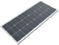
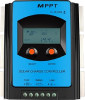
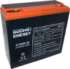
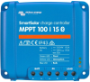
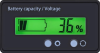

# Solar

I am dabbling with building solar systems.
Currently I have a single panel single battery rig in my shop.
I want to build up knowledge and experience and electrify the shop, the barn and
a couple of other sites in the coming years.

This document tracks the progress of my solar education as well as the status of
all of the solar systems I have in mind or am already building.

## Shop

I have a little workshop room in my barn which is where my solar experimentation
started.

This system started off with this setup:

- Viking SCM135 135 Wp panel
- BYGD SPT-20A MPPT controller
- Goowei 6-DZM-20 12 V 24 Ah SLA battery

I got all of these components off Alza in order to put together a small POC.

Nowadays it sports and upgraded controller and battery:

- Viking SCM135 135 Wp panel
- Victron SmartSolar 100/15 MPPT controller
- SOK 12 V 206 Ah LFP battery

The controller upgrade is there as I am gearing up to introduce a 4 panel series
array which will need a beefier controller like the one I got and the battery is
there for the same reason as the new array should deliver more punch.

This is what the system will look like once I install the new panels I got:

- Victron 175 Wp 4s1p
- Victron SmartSolar 100/15 MPPT controller
- SOK 12 V 206 Ah LFP battery

I also have an order of two battery gauges in transit and I will install these
to be able to monitor both the capacity and the voltage of the battery at the
same time.

- [ ] Get the battery gauge delivered

The solar panel produces 135 W at peak sun cover.
Assuming a four hour peak sun cover, that's 540 Wh in a day.
The battery capacity is 200 Ah * 12 V = 2400 Wh.
This means we can replenish 20 % of the battery capacity every day.
I am powering three 5 W car bulbs for 24 hours a day off it currently.
That's 15 W a day.
Disconnected from the solar panel and at full capacity, the battery could power
this load for 2400 Wh / 15 W = 160 h = 6 days.
In a day, the full 24 hours, the bulbs consume 15 W * 24 h = 360 Wh.
Since the panel produces 540 Wh in ideal conditions and around 380 Wh with the
70 % factor, its production should just about cover this load consumption each
day.
Theoretically, the system should be able to run continuously forever, then.

Yet, it died after less than a week, almost exactly as if the battery was not
even charging in the first place.

- [ ] Figure out what happened with the charge controller once I am at the barn

With the four new panels in 4s1p I'd be getting 800 W * 4 h = 3200 Wh a day.
With the 70 % factor, that's 2240 Wh.
The battery capacity is 2400 Wh so the new system should be able to cycle or
very close to cycle the battery every day.

And if that turns out to be correct and working, I should be able to use those
2400 W each day across various loads including a 12 V DC to 230 V AC inverter.

| Image | Link |
|-|-|
|  | [Viking SCM135 135 Wp][viking-scm135] |
|  | [BYGD SPT-20A][bygd-spt-20a] |
|  | [Goowei 6-DZM-20 12 V 24 Ah SLA][goowei-6-dzm-20] |
|  | [Victron SmartSolar 100/15 MPPT BT][victron-100-15-bt] |
|  | [SOK 12 V 205 Ah LFP][sok-12v-206ah] |
|  | [Victron 175 Wp][victron-175wp] |
|  | [AliExpress battery gauge (percentage mode)][battery-gauge] |
|  | [AliExpress battery gauge (voltage mode)][battery-gauge] |

[viking-scm135]: https://www.alza.cz/viking-solarni-panel-scm135-d7240974.htm
[bygd-spt-20a]: https://www.alza.cz/bygd-solarni-regulator-nabijeni-spt-20a-d6959818.htm
[goowei-6-dzm-20]: https://www.alza.cz/auto/goowei-energy-6-dzm-20-baterie-12v-24ah-electric-vehicle-d6217380.htm
[victron-100-15-bt]: https://www.naradihned.cz/solarni-regulatory-victron-energy/mppt-solarni-regulator-victron-energy-smartsolar-100-15
[sok-12v-206ah]: https://www.europe.sokbattery.com/product-page/marine-grade-12v-206ah-lifepo4-battery-sealed-plastic-box-bluetooth-built-in-he
[victron-175wp]: https://www.solar-eshop.cz/p/fv-panel-victron-energy-175wp
[battery-gauge]: https://www.aliexpress.com/item/1005001763596519.html

## Resources

There is a bunch of solid solar resources online and I've already absorbed a
few basic lessons, but I still have a lot to learn.
The resource I find the most promising at the moment is the collective work of
Will Prowse distributed across his:

- [*DIY Solar Power* channel](https://www.youtube.com/c/WillProwse)
- [mobile-solarpower.com site](https://www.mobile-solarpower.com)
- [*DIY Solar Power* forum](https://diysolarforum.com)

I might come up with a study plan and I will definitely intertwine projects of
increasing scale into the learing process, all of which will be covered in this
repository.

I also bought Will's book.

### Basic sizing calculation

1. Calculate the theoretical panel/array performance
  - Note that the panel voltage should be around 5 V above battery voltage
  - Multiply amperage by voltage to get the wattage, e.g.: 10 A at 18 V = 180 W
  - Multiply the power by the peak sun cover hours, e.g.: 180 W * 4 h = 720 Wh
  - Multiply by the factor of 70 % to get closer to real life performance
2. Calculate the battery capacity
  - Multiply the amperage per hour by the voltage, e.g.: 200 Ah * 12 V = 2400 Wh
3. Calculate the peak sun cover hours required to fully charge the battery
  - Divide battery capacity by the solar capacity, e.g.: 2400 Wh / 720 Wh = 4 h
4. Calculate the desired load to see how long the battery can power it for
  - Ensure you are using compatible load, 12 V load for a 12 V battery
  - Divide the battery capacity by the power draw, e.g.: 2400 Wh / 12 W = 6 d

## WIP

### Battery gauge

I bought this battery gauge:

https://www.aliexpress.com/item/1005001763596519.html

I have it hooked up to a 12 V SLA battery in the window system, but it shows it
at 100 % no matter what.
The voltage is displayed correctly.

I think the problem might be with it not being set up for SLA?

I have not found a way to configure it in this listing, but I found it listed by
another vendor here:

https://www.aliexpress.com/item/4000448925124.html

Here are the instructions:

1. Disconnect the module power supply, press and hold the setting button until 
   powering the power module. Display shows the current power setting parameters
2. Press the setting button to select P / L / F ,(P = 12V lead acid, L = 3.7V
   lithium battery, F = 3.2V lithium iron phosphate battery)
3. Press the function key to set the number of the battery string, according to
   the function keys and set the key up or down to choose the number of
   batteries in series
4. Press the function key for a long time to enter the advanced setting
   interface, use setting key to select S1-S5, enter key to select or cancel the
   current mode
5. Reenergize the power after setting.
   The power automatically saves setting data.

E.g. 10 lithium battery power, turn on power percentage and voltage automatic
rotation display (S1 mode)

Operation: Disconnect display module power, press and hold the setting button,
power the power module, press the setting button for a short time to select L,
press the function key to select 10, press the function key for a long time to
select S1 and re-power.

At some point I will figure this out and fix it.

### Land-mounted solar panel array

Since my current test setup only uses a single panel mounted at the exterior
wall of my shop, I have decided to upgrade and buy a couple of solar panels to
form an array.
I will mount the array on a construction I will design and manufacture which
will live on land so I don't have to mount it on the building.

I bought 5 of these Victron BlueSolar solar panels:

https://www.solar-eshop.cz/p/fv-panel-victron-energy-175wp

- [ ] Design and build a mount for the panels
- [ ] Mount the panels onto the construction

The panels are 175 W, ~10 A at ~18 V (under load).
There are a few configurations these could be wired in:

- 5 in parallel: sum of amperages, same voltage, so 50 A, 20 V
- 5 in series: sum of voltages, same amperage, so 100 V, 10 A
- A series-parallel configuration - there are multiple options

Connecting them in parallel is not a great idea, because I would have to get
some dummy thick wires and controller to be able to move 50 A of current.
As I understand it, a 100 % parallel setup is mainly used with small systems
which use PWM controllers, not really as much with MPPT controllers.

Connecting them in series could work, but only with a solar charge controller
capable of handling 100 V at 10 A.

https://www.alza.cz/victron-mppt-regulator-smartsolar-100-15-d5855306.htm

This one matches exactly!
But almost too exactly.
It is my understanding that it is best to leave some headroom so that the solar
charge controller can handle temperature change etc.
Running it this close to the max spec could ruin it and they aren't cheap.

Let's run through the options for a series-parallel connection.
I am going to consider only the options with equal array lengths.
Here is an article which goes over mixing different solar panels (or strings)
and it almost always results in lower efficiency:

https://www.explorist.life/using-mismatched-solar-panel-sizes

- 2 panels (400 W):
  - 1s2p = 1 * (20 A, 20 V) = 20 A, 20 V
  - 2s1p = 2 * (10 A, 20 V) = 10 A, 40 V
- 4 panels (800 W):
  - 1s4p = 40 A, 20 V
  - 2s2p = 2 * (20 A, 20 V) = 20 A, 40 V
  - 4s1p = 4 * (10 A, 20 V) = 10 A, 80 V
- 6 panels (1200 W):
  - 1s6p = 1 * (60 A, 20 V) = 60 A, 20 V
  - 2s3p = 2 * (30 A, 20 V) = 30 A, 40 V
  - 3s2p = 3 * (20 A, 20 V) = 20 A, 60 V
- 8 panels (1600 W):
  - 1s8p = 1 * (80 A, 20 V) = 80 A, 20 V
  - 2s4p = 2 * (40 A, 20 V) = 40 A, 40 V
  - 4s2p = 4 * (20 A, 20 V) = 20 A, 80 V
  - 8s1p = 8 * (10 A, 20 V) = 10 A, 160 V

Looking at Alza, my local electronics retailer who carry some Victron solar
charge controllers, these are my options as I see them with the current stock:

https://www.alza.cz/victron-mppt-regulator-smartsolar-100-15-d5855306.htm

100 V / 15 A could support `1s4p` and I would leave one of the panels out.

https://www.alza.cz/victron-mppt-regulator-smartsolar-100-30-d5855308.htm

100 V / 30 A could support `4s2p` if I got three extra panels on top.

Everything else falls short.
Namely, the 75 V ones are all unusable because every configuration above that is
below 75 V is either or over 10 A.
At best I could use one with `2s1p` but that's only two panels and even then I
would be pushing its amperage spec.

I am only looking at the Bluetooth models as I want to use the Victron app for
monitoring.

I looked around to see if I can find a better deal and I found this store:

https://www.naradihned.cz/solarni-regulatory-victron-energy

https://www.naradihned.cz/solarni-regulatory-victron-energy/mppt-solarni-regulator-victron-energy-smartsolar-100-30/

100 V / 30 A is available for less than Alza!

However, I also learnt that the higher level solar charge controllers don't have
a DC output that I could hook up a 12 V DC to 230 V AC invertor.

It seems one is supposed to get something called a battery protect, e.g.:

https://www.naradihned.cz/ochrana-baterii/ochrana-baterii-bp-100-12-24v

This will prevent the battery from draining.
I am not sure how it would be wired exactly, I guess share ground and connect
the load positive and the battery positive, but it seems suspicious that the
ground connector is so small, I would expect a higher AWG connector.

I might try and push my luck with sizing my constant load (e.g.: lights) such
that it never drains the battery before it has had a chance to replenish the
next day.

But I am also thinking I just might push my luck with a 100 V / 10 A solar
charge controller from this new vendor because it has load terminals:

https://www.naradihned.cz/solarni-regulatory-victron-energy/mppt-solarni-regulator-victron-energy-smartsolar-100-15/

If the solar panels get cold and produce too many volts or the sun is beating
down on them perfectly and they are angled just right and exceed the 100 V spec
of this solar charge controller, it will most likely get ruined.

But my math is it is better to potentially ruin a 3.5k CZK solar charge
controller than to get a 5.7k one and either risk ruining a much more expensive
battery than these controller are or buying an extra 1.5k battery protect to go
along with it just so that I can connect a load to it.

I am going to get the 100 V / 15 A Bluetooth one from NaradiHned as it costs
3.5k CZK there as opposed to 5.3k on Alza.
It will take longer to arrive, but I can wait.

- [ ] Get the 100 V / 15 A controller from NaradiHned delivered to the box

Once I get more panels, I will get the 100 V / 30 A one and sell this one.

I should have a 300 W 12 V DC and 230 V AC invertor somewhere, it should be this
one:

https://www.alza.cz/auto/compass-menic-napeti-12-230v-300w-d4946056.htm

If I don't find it, I will get another off Alza as this store doesn't have any
in stock, but if by then it does, I will use it, because Alza is overpriced for
these like the solar charge controllers.

- [ ] Find or order a 12 V DC to 230 V AC invertor
