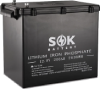
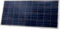

# Shop

I have a little workshop room in my barn which is where my solar experimentation
started.

## Status

This system is up and running, powering the lights in my shop, but I am treating
it as a work in progress thing and will improve it over time.

## History

### Build out the initial prototype system

I got all of these components off Alza in order to put together a small POC.

```diff
+ Viking SCM135 135 Wp panel
+ BYGD SPT-20A MPPT controller
+ Goowei 6-DZM-20 12 V 24 Ah SLA battery
```

### Replace the SLA battery with a SOK LFP battery

I bought a SOK battery to replace the SLA battery from Alza with.
It has larger capacity and is resistant to humidity and temperature changes, it
even has an internal heater for low temperature application.

```diff
  Viking SCM135 135 Wp panel
  BYGD SPT-20A MPPT controller
- Goowei 6-DZM-20 12 V 24 Ah SLA battery
+ SOK 12 V 206 Ah LFP battery
```

### Upgrade to a Victron solar charge controller

The controller I was using was very basic.
I got a Victron so that I can monitor the system over Bluetooth using their app.

```diff
  Viking SCM135 135 Wp panel
- BYGD SPT-20A MPPT controller
+ Victron SmartSolar 100/15 MPPT controller
  SOK 12 V 206 Ah LFP battery
```

At this point I wasn't sure whether the bottleneck of the system was the panel
or the battery, but I think already the panel was able to fully charge the
battery daily in this setup.

### Introduce a battery gauge to display the voltage on camera

The shop is monitored with a security camera that I can view remotely, so I got
two battery gauges to display the voltage and the percentage at the same time.

I have installed only one so far as I needed the other for the window system, so
I ordered more and will install the percentage one next.

```diff
  Viking SCM135 135 Wp panel
  Victron SmartSolar 100/15 MPPT controller
  SOK 12 V 206 Ah LFP battery
+ Voltage battery gauge
```

### Replace the panel with two Victron 174 Wp panels in series

I have 5 Victron BlueSolar 175 Wp panels on hand which I plan to eventually
build a wall mounted array with, but before I do that, I took two and replaced
the shop panel with them connected in series.

```diff
- Viking SCM135 135 Wp panel
+ Victron BlueSolar 175 Wp 2s1p
  Victron SmartSolar 100/15 MPPT controller
  SOK 12 V 206 Ah LFP battery
  Voltage battery gauge
```

They are 20 V 10 A panels so in series they give 40 V 10 A on the string which
is well within the spec of the 100 V 15 A solar charge controller.

## Components

As of current the system consists of these parts:

- Victron BlueSolar 175 Wp 2s1p
- Victron SmartSolar 100/15 MPPT controller
- SOK 12 V 206 Ah LFP battery
- Voltage battery gauge

This table summarizes current and historical parts used in the system.

| Image | Link |
|-|-|
|  | [Viking SCM135 135 Wp][viking-scm135] |
|  | [BYGD SPT-20A][bygd-spt-20a] |
|  | [Goowei 6-DZM-20 12 V 24 Ah SLA][goowei-6-dzm-20] |
|  | [Victron SmartSolar 100/15 MPPT BT][victron-100-15-bt] |
|  | [SOK 12 V 205 Ah LFP][sok-12v-206ah] |
|  | [Victron 175 Wp][victron-175wp] |
|  | [AliExpress battery gauge (percentage mode)][battery-gauge] |
|  | [AliExpress battery gauge (voltage mode)][battery-gauge] |

[viking-scm135]: https://www.alza.cz/viking-solarni-panel-scm135-d7240974.htm
[bygd-spt-20a]: https://www.alza.cz/bygd-solarni-regulator-nabijeni-spt-20a-d6959818.htm
[goowei-6-dzm-20]: https://www.alza.cz/auto/goowei-energy-6-dzm-20-baterie-12v-24ah-electric-vehicle-d6217380.htm
[victron-100-15-bt]: https://www.naradihned.cz/solarni-regulatory-victron-energy/mppt-solarni-regulator-victron-energy-smartsolar-100-15
[sok-12v-206ah]: https://www.europe.sokbattery.com/product-page/marine-grade-12v-206ah-lifepo4-battery-sealed-plastic-box-bluetooth-built-in-he
[victron-175wp]: https://www.solar-eshop.cz/p/fv-panel-victron-energy-175wp
[battery-gauge]: https://www.aliexpress.com/item/1005001763596519.html

## Performance

The system is able to charge the battery fully based on the daily sun yield.
The battery is the constraining element of the system now.

I have three 5 W 12 V lights connected as a load.
They consume 15 W 1 A.
When the system is on 24 / 7, the battery gets drained to 20 % and turns off so
the system is not able to cycle.
I have switched them to streetlamp mode for now, but I want them to be able to
run for 24 hours a day, so I will need to get another battery.

Also I want to get an inverter to be able to power the camera off the system as
well.
I will find a true sine wave inverter for this (so it is suitable for inductive
loads as well and I can use it for power tools, too) and a USB C inverter to not
have to pay the 230 V loss for small electronics which step it down and to DC
right away anyway.

The solar panels produce 350 W theoretical at peak sun cover.
According to [Global Solar Atlas](https://globalsolaratlas.info), I should get
on average about 2.5 sun peak hours at my location.


So, 350 Wp at 2.5 h = 625 Wh.
The battery capacity is 200 Ah * 12 V = 2400 Wh.

Somehow, this works out to approximately 25 % of the battery capacity, but I've
seen the panels charge the battery from 20 % to full capacity even before the
noon.

Not sure what gives, I need to learn more about this and double check whether I
actually did witness that.

Anyway, the load is 15 W.
It works out to something like 12 V 1 A, a bit more than that.
For 24/7 usage, we need 360 Wh a day.

The battery should be able to power the lights for 2400 Wh / 360 Wh = 6.5 h.
In my experience, the battery is not able to power the lights for 24/7 indeed,
but it is able to run them for around 15 hours or something, so I am not sure
why these calculations don't work out.


## To-Do

- [ ] Get the percentage battery gauge delivered and installed
- [ ] Order another SOK battery to build a parallel battery bank
- [ ] Research a true sine wave 230 V inverter
- [ ] Get a USB C inverter for use with small electronics
- [ ] Find out how come the panels can charge the battery when 624 Wh < 2400 Wh
- [ ] Find out why the lights run for ~15 h not 2400/360 = 6.7 h on battery
